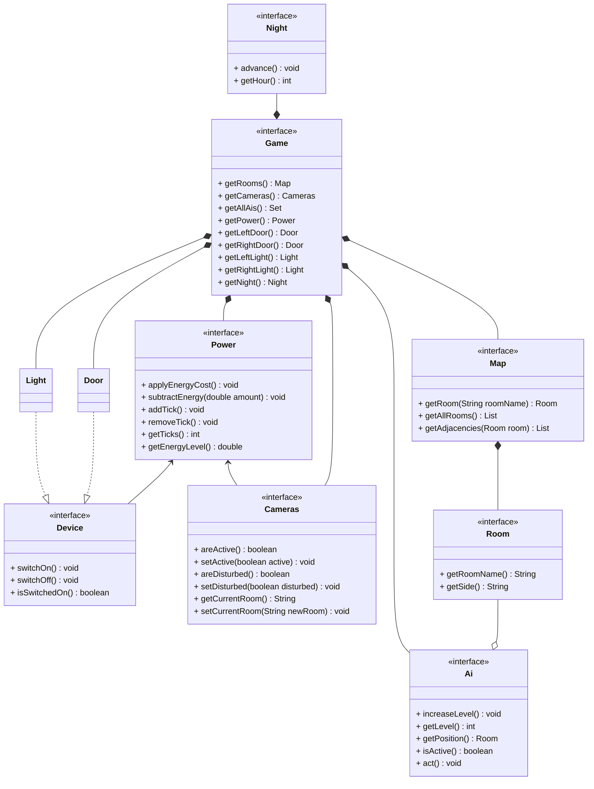
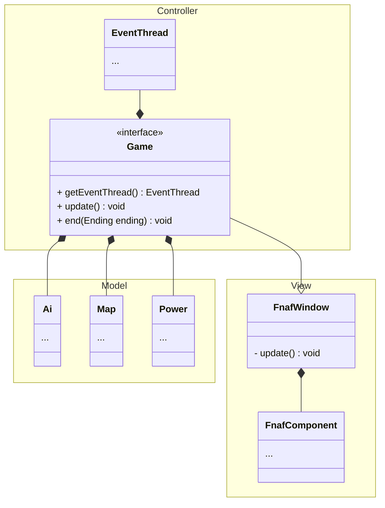

# Five Nights at Freddy's Retro

Relazione per il progetto del corso di Programmazione ad Oggetti

- Marco Buda
- Filippo Del Bianco
- Luca Ponseggi
- Davide Sancisi

15-02-2024

## Indice

1. [Analisi](#capitolo-1---analisi")
    - 1.1 [Requisiti](#11-requisiti)
    - 1.2 [Analisi e modello del dominio](#12-analisi-e-modello-del-dominio)
2. [Design](#capitolo-2---design)
    - 2.1 [Architettura](#21-architettura)
    - 2.2 [Design dettagliato](#22-design-dettagliato)
3. [Sviluppo](#capitolo-3---sviluppo)
    - 3.1 [Testing automatizzato](#31-testing-automatizzato)
    - 3.2 [Metodologia di lavoro](#32-metodologia-di-lavoro)
    - 3.3 [Note di sviluppo](#33-note-di-sviluppo)
4. [Commenti finali](#capitolo-4---commenti-finali)
    - 4.1 [Autovalutazione e lavori futuri](#41-autovalutazione-e-lavori-futuri)
+ Appendice A - [Guida utente](#appendice-a---guida-utente)

## Capitolo 1 - Analisi

### 1.1 Requisiti

Il gruppo si pone l'obiettivo di realizzare un videogioco survival horror punta e clicca in prima persona, ricreando una versione più o meno semplificata della famosa saga "Five Nights at Freddy's".

"Il giocatore si ritrova a dover sorvegliare una pizzeria, ma osservando le telecamere si accorge che alcuni pupazzi meccanici sembrano essersi spostati da soli. Per sopravvivere fino al sorgere del Sole dovrà imparare a conoscere le strategie dei singoli nemici, e usare tutti gli strumenti a sua disposizione per proteggersi dai loro attacchi, il tutto prestando attenzione alle limitate riserve energetiche."

#### Requisiti funzionali

- L'applicativo deve comprendere un menù che permetta di impostare il livello di aggressività iniziale dei nemici

- Deve permettere di creare e gestire una partita con le impostazioni date, presentandola all'utente tramite un'interfaccia grafica

- Durante una partita, deve consentire all'utente di alternare tra la visuale in prima persona e la schermata delle telecamere

- Deve implementare il movimento e le strategie di attacco dei nemici presenti nel gioco originale

- Deve permettere all'utente di interagire con le luci laterali, utili per individuare la presenza di nemici che stanno per attaccare, e di difendersi chiudendo le porte di sicurezza 

- Deve monitorare il consumo dell'energia tenendo conto del numero di dispositivi attivi, quali luci, porte e telecamere

- Deve far avanzare la notte fino alle ore 6:00, che comportano la vittoria della partita

#### Requisiti non funzionali

- L'interfaccia deve essere immediata e simile al gioco originale

- Deve offrire la possibilità di essere ridimensionata in modo da adattarsi ad una qualunque risoluzione

- Deve gestire al meglio le risorse hardware e non deve soffrire di cali di performance

- L'esperienza di gioco deve ricordare lo stile del titolo a cui ci siamo ispirati

### 1.2 Analisi e modello del dominio

Le entità coinvolte in una partita sono varie.

Si ha a disposizione una quantità limitata di energia. Questa viene consumata nel corso della notte, tanto più velocemente quanti più sono i dispositivi attivi, senza possibilità di essere recuperata.

La stanza in cui si trova il giocatore ha due ingressi laterali, ognuno dei quali è provvisto di una luce ed una porta di sicurezza attivabili e disattivabili dall'utente.

Il giocatore è munito di un tablet che gli permette di accedere alle telecamere di sicurezza della struttura, le quali però vengono temporaneamente disattivate quando un nemico decide di spostarsi.

Nell'edificio si aggirano quattro entità nemiche che per semplicità chiameremo "AI". Ognuna di esse ha un livello di aggressività che aumenta durante la notte ed un comportamento caratteristico.

Schema UML dell’analisi del problema, con rappresentate le entità principali ed i rapporti fra loro:

## Capitolo 2 - Design

### 2.1 Architettura

L'architettura di Five Nights at Freddy's Retro segue il pattern MVC, prestando particolare attenzione a mantenere le parti di model e controller indipendenti da quella della view. In particolare le interfacce del progetto sono suddivise nel seguente modo:
- Il model è rappresentato dalle interfacce descritte al punto [1.2](#12-analisi-e-modello-del-dominio).
- La view è implementata con una serie di componenti grafiche personalizzate e piuttosto generiche che facilitano la creazione di un gioco in pixel art che reagisca al ridimensionamento della finestra.
- Il controller è realizzato dall'interfaccia Game e da altre utilità che gestiscono il thread di gioco. Questo si basa sulla schedulazione di eventi sincronizzati all'interno di tick di gioco.

Questo diagramma non è completo: serve ad illustrare come interagiscono le varie parti del pattern MVC.

### 2.2 Design dettagliato

#### 2.2.1 Filippo Del Bianco

#### 2.2.2 Marco Buda

#### 2.2.3 Luca Ponseggi

#### 2.2.4 Davide Sancisi

## Capitolo 3 - Sviluppo

### 3.1 Testing automatizzato

Per verificare le corrette implementazioni delle funzionalità di gioco abbiamo utilizzato la piattaforma JUnit 5. Sono stati sviluppati diversi test mirati principalmente al model e al controller, con l'obiettivo di valutare le funzionalità e le prestazioni di tali componenti.

Nello specifico, si sono realizzati i seguenti test:
- `TestAi`: verifica la progressione del livello di aggressività dei nemici e il loro spostamento.
- `TestDoor`: verifica il funzionamento della porta.
- `TestLights`: verifica il funzionamento e la sincronizzazione delle luci.
- `TestEventQueue`: verifica l'inserimento e l'estrazione degli eventi dalla coda.
- `TestGameMap`: .
- `TestNight`: verifica la progressione della notte.
- `TestPower`: verifica la gestione dell'energia.

### 3.2 Note di sviluppo

#### Marco Buda

#### Filippo Del Bianco

#### Luca Ponseggi

- Utilizzo di Lambda Expression. Seguono alcuni esempi:

-- Link --

-- Link --

- E così via

#### Davide Sancisi

## Capitolo 4 - Commenti finali

### 4.1 Autovalutazione e lavori futuri

#### Marco Buda

#### Filippo Del Bianco

#### Luca Ponseggi

#### Davide Sancisi

## Appendice A - Guida utente

### Introduzione

La seguente è un'introduzione di massima per familiarizzarsi con il gioco; maggiori informazioni sulle strategie di attacco dei nemici e sulla gestione dell'energia possono essere trovate nella documentazione del codice.

L'obiettivo del gioco è sopravvirere l'intera notte (6 ore) difendendosi dagli attacchi dei nemici.

I nemici presenti nel gioco prendono il nome di animatroni e sono quattro:
- Freddy, si presenta come un orsetto marrone con un cappello a cilindro sulla testa; a differenza di altri si muove secondo un percorso prestabilito e 

come si presenta, come si countera, in che stanze si muove

TODO:
- telecameta tutta a destra che non funziona
- Costanti di energia (roba che dovrebbe mettere dave nella sua parte)
- mappa di gioco e altre cose le descrive filo nella sua parte
- spiegare i comportamenti delle AI

