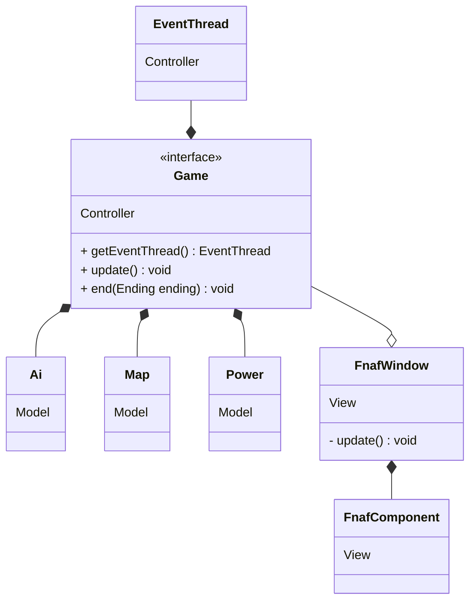

# Five Nights at Freddy's Retro

Relazione per il progetto del corso di Programmazione ad Oggetti

- Marco Buda
- Filippo Del Bianco
- Luca Ponseggi
- Davide Sancisi

15-02-2024

## Indice

1. [Analisi](#capitolo-1---analisi")
    - 1.1 [Requisiti](#11-requisiti)
    - 1.2 [Analisi e modello del dominio](#12-analisi-e-modello-del-dominio)
2. [Design](#capitolo-2---design)
    - 2.1 [Architettura](#21-architettura)
    - 2.2 [Design dettagliato](#22-design-dettagliato)
3. [Sviluppo](#capitolo-3---sviluppo)
    - 3.1 [Testing automatizzato](#31-testing-automatizzato)
    - 3.2 [Note di sviluppo](#32-note-di-sviluppo)
4. [Commenti finali](#capitolo-4---commenti-finali)
    - 4.1 [Autovalutazione e lavori futuri](#41-autovalutazione-e-lavori-futuri)
+ Appendice A - [Guida utente](#appendice-a---guida-utente)

## Capitolo 1 - Analisi

### 1.1 Requisiti

Il gruppo si pone l'obiettivo di realizzare un videogioco survival horror punta e clicca in prima persona, ricreando una versione più o meno semplificata della famosa saga "Five Nights at Freddy's".

"Il giocatore si ritrova a dover sorvegliare una pizzeria, ma osservando le telecamere si accorge che alcuni pupazzi meccanici sembrano essersi spostati da soli. Per sopravvivere fino al sorgere del Sole dovrà imparare a conoscere le strategie dei singoli nemici, e usare tutti gli strumenti a sua disposizione per proteggersi dai loro attacchi, il tutto prestando attenzione alle limitate riserve energetiche."

#### Requisiti funzionali

- L'applicativo deve comprendere un menù che permetta di impostare il livello di aggressività iniziale dei nemici

- Deve permettere di creare e gestire una partita con le impostazioni date, presentandola all'utente tramite un'interfaccia grafica

- Durante una partita, deve consentire all'utente di alternare tra la visuale in prima persona e la schermata delle telecamere

- Deve implementare il movimento e le strategie di attacco dei nemici presenti nel gioco originale

- Deve permettere all'utente di interagire con le luci laterali, utili per individuare la presenza di nemici che stanno per attaccare, e di difendersi chiudendo le porte di sicurezza 

- Deve monitorare il consumo dell'energia tenendo conto del numero di dispositivi attivi, quali luci, porte e telecamere

- Deve far avanzare la notte fino alle ore 6:00, raggiunte le quali la partita si conclude con la vittoria del giocatore

- (Opzionale) Deve emettere effetti sonori al click dei bottoni nel menù e nel gioco, alla vittoria e alla sconfitta del giocatore

#### Requisiti non funzionali

- L'interfaccia deve essere immediata e simile al gioco originale

- Deve offrire la possibilità di essere ridimensionata in modo da adattarsi ad una qualunque risoluzione

- Deve gestire al meglio le risorse hardware e non deve soffrire di cali di performance

- L'esperienza di gioco deve ricordare lo stile del titolo a cui ci siamo ispirati

### 1.2 Analisi e modello del dominio

Le entità coinvolte in una partita sono varie.

Si ha a disposizione una quantità limitata di energia. Questa viene consumata nel corso della notte, tanto più velocemente quanti più sono i dispositivi attivi, senza possibilità di essere recuperata.

La stanza in cui si trova il giocatore ha due ingressi laterali, ognuno dei quali è provvisto di una luce e di una porta di sicurezza attivabili e disattivabili dall'utente.

Il giocatore è munito di un tablet che gli permette di accedere alle telecamere di sicurezza della struttura, le quali però vengono temporaneamente disattivate quando un nemico decide di spostarsi.

Nell'edificio si aggirano quattro entità nemiche che per semplicità chiameremo "AI". Ognuna di esse ha un comportamento caratteristico ed un livello di aggressività che aumenta durante la notte.

Schema UML dell’analisi del problema, con rappresentate le entità principali ed i rapporti fra loro:

## Capitolo 2 - Design

### 2.1 Architettura

L'architettura di Five Nights at Freddy's Retro segue il pattern MVC, prestando particolare attenzione a mantenere le parti di model e controller indipendenti da quella della view. In particolare le interfacce del progetto sono suddivise nel seguente modo:
- Il model è rappresentato dalle interfacce descritte al punto [1.2](#12-analisi-e-modello-del-dominio).
- La view è implementata con una serie di componenti grafiche personalizzate e piuttosto generiche che facilitano la creazione di un gioco in pixel art che reagisca al ridimensionamento della finestra.
- Il controller è realizzato dall'interfaccia Game e da altre utilità che gestiscono il thread di gioco. Questo si basa sulla schedulazione di eventi sincronizzati all'interno di tick di gioco.

Questo diagramma non è completo, ma illustra come interagiscono le varie parti del pattern MVC.

### 2.2 Design dettagliato

#### 2.2.1 Filippo Del Bianco

#### 2.2.2 Marco Buda

#### 2.2.3 Luca Ponseggi

#### 2.2.4 Davide Sancisi

## Capitolo 3 - Sviluppo

### 3.1 Testing automatizzato

Per verificare la corretta implementazione delle funzionalità di gioco abbiamo utilizzato la piattaforma JUnit 5. Sono stati sviluppati diversi test mirati principalmente al model e al controller, con l'obiettivo di valutare le funzionalità e le prestazioni di tali componenti.

Nello specifico, si sono realizzati i seguenti test:
- `TestAi`: verifica la progressione del livello di aggressività dei nemici e il loro spostamento.
- `TestDoor`: verifica il funzionamento della porta.
- `TestLights`: verifica il funzionamento e la sincronizzazione delle luci.
- `TestEventQueue`: verifica l'inserimento e l'estrazione degli eventi dalla coda.
- `TestGameMap`: verifica l'inizializzazione delle stanze e dei collegamenti fra di esse.
- `TestNight`: verifica la progressione della notte.
- `TestPower`: verifica la gestione dell'energia.

### 3.2 Note di sviluppo

#### Marco Buda

Utilizzo di Stream, Lambda, Method Reference, Runnable, Consumer e Function, spesso combinati. Alcuni esempi:

https://github.com/PastaCodes/OOP23-fnaf-retro/blob/b814da847d4a76b017b60e9e30415453c6ce215b/src/main/java/it/unibo/fnafretro/ai/Ai.java#L50-L75

https://github.com/PastaCodes/OOP23-fnaf-retro/blob/b814da847d4a76b017b60e9e30415453c6ce215b/src/main/java/it/unibo/fnafretro/ai/Chica.java#L58-L68

https://github.com/PastaCodes/OOP23-fnaf-retro/blob/4cc615741b442ad7b6e385d7524a0ac40e107a29/src/main/java/it/unibo/fnafretro/game/EventThreadImpl.java#L34-L37

https://github.com/PastaCodes/OOP23-fnaf-retro/blob/4cc615741b442ad7b6e385d7524a0ac40e107a29/src/main/java/it/unibo/fnafretro/gui/FnafrImageComponent.java#L93-L112

https://github.com/PastaCodes/OOP23-fnaf-retro/blob/4cc615741b442ad7b6e385d7524a0ac40e107a29/src/main/java/it/unibo/fnafretro/game/Game.java#L75-L77

Utilizzo di Optional. Alcuni esempi:

https://github.com/PastaCodes/OOP23-fnaf-retro/blob/b814da847d4a76b017b60e9e30415453c6ce215b/src/main/java/it/unibo/fnafretro/game/EventQueueImpl.java#L24

https://github.com/PastaCodes/OOP23-fnaf-retro/blob/b814da847d4a76b017b60e9e30415453c6ce215b/src/main/java/it/unibo/fnafretro/gui/FnafrComponent.java#L140

#### Filippo Del Bianco

#### Luca Ponseggi

- Utilizzo di Lambda Expression:

https://github.com/PastaCodes/OOP23-fnaf-retro/blob/4cc615741b442ad7b6e385d7524a0ac40e107a29/src/main/java/it/unibo/fnafretro/gui/FnafrCard.java#L78-L80

https://github.com/PastaCodes/OOP23-fnaf-retro/blob/4cc615741b442ad7b6e385d7524a0ac40e107a29/src/main/java/it/unibo/fnafretro/gui/FnafrButton.java#L106-L109

- Utilizzo di method reference:

https://github.com/PastaCodes/OOP23-fnaf-retro/blob/86abd7aa6b3f602cae800e09a353192c2cd1d309/src/main/java/it/unibo/fnafretro/night/NightImpl.java#L27-L29

- Utilizzo di Consumer, Function e Runnable:

https://github.com/PastaCodes/OOP23-fnaf-retro/blob/4cc615741b442ad7b6e385d7524a0ac40e107a29/src/main/java/it/unibo/fnafretro/gui/FnafrCard.java#L97

https://github.com/PastaCodes/OOP23-fnaf-retro/blob/4cc615741b442ad7b6e385d7524a0ac40e107a29/src/main/java/it/unibo/fnafretro/gui/FnafrButton.java#L151

https://github.com/PastaCodes/OOP23-fnaf-retro/blob/4cc615741b442ad7b6e385d7524a0ac40e107a29/src/main/java/it/unibo/fnafretro/gui/FnafrButton.java#L136

https://github.com/PastaCodes/OOP23-fnaf-retro/blob/4cc615741b442ad7b6e385d7524a0ac40e107a29/src/main/java/it/unibo/fnafretro/gui/FnafrButton.java#L104

- Utilizzo della libreria `javax.sound.sampled.*`, in particolare della classe Clip, per l'inserimento degli effetti sonori nel codice.

Link a risorse esterne utilizzate:

- Piccolo frammento di codice che spiega come aumentare il volume della clip: https://www.tabnine.com/code/java/methods/javax.sound.sampled.Clip/getControl?snippet=5922beef4002b00004e0e8ce
- File audio royalty free utilizzati: https://opengameart.org/, https://cdn.pixabay.com/

#### Davide Sancisi

- Utilizzo di Function:

https://github.com/PastaCodes/OOP23-fnaf-retro/blob/3dfca308af36dd8e746a2477e999bda9ceb082ea/src/main/java/it/unibo/fnafretro/gui/FnafrImage.java#L88-L92

- Utilizzo di Consumer:

https://github.com/PastaCodes/OOP23-fnaf-retro/blob/3dfca308af36dd8e746a2477e999bda9ceb082ea/src/main/java/it/unibo/fnafretro/gui/FnafrImage.java#L95-L97

https://github.com/PastaCodes/OOP23-fnaf-retro/blob/3dfca308af36dd8e746a2477e999bda9ceb082ea/src/main/java/it/unibo/fnafretro/gui/FnafrLabel.java#L98-L100

- Utilizzo di method reference, stream e lambda:

https://github.com/PastaCodes/OOP23-fnaf-retro/blob/3dfca308af36dd8e746a2477e999bda9ceb082ea/src/main/java/it/unibo/fnafretro/power/PowerImpl.java#L33-L36

- Utilizzo di method reference:

https://github.com/PastaCodes/OOP23-fnaf-retro/blob/3dfca308af36dd8e746a2477e999bda9ceb082ea/src/main/java/it/unibo/fnafretro/power/PowerImpl.java#L21

## Capitolo 4 - Commenti finali

### 4.1 Autovalutazione e lavori futuri

#### Marco Buda

#### Filippo Del Bianco

#### Luca Ponseggi

#### Davide Sancisi

La realizzazione di questo progetto è stata, personalmente, una sfida non da poco sia da un punto di vista tecnico che morale. Essendo uno studente-lavoratore ma soprattutto uno che non ha mai brillato nell'ambito della programmazione in generale, pur venendo da una scuola tecnica. Difatti mi sono ritrovato ad affrontare molti problemi concettuali e pratici che magari altri non avrebbero avuto e che mi hanno portato via più tempo e risorse. Ciononostante la sensazione di essere riuscito con il mio gruppo oggi a consegnare questo progetto rispettando gli obbiettivi preposti e la dead-line è molto gratificante e ripaga le molteplici situazioni meno gradevoli che ho passato lungo il percorso di progettazione. Un mio più sincero ringraziamento va a Marco Buda che si è preso la responsabilità di leader del gruppo, e non solo ha svolto in maniera egregia il suo compito, ma è stato fondamentale per me avendomi in più occasioni fornito delle delucidazioni fondamentali su alcuni aspetti tecnici e di pulizia del codice. Dulcis in fundo, ci tengo a precisare che le risorse messe a nostra disposizione dal docente del corso di programmazione ad oggetti si sono rivelate davvero utili, avendomi aiutato in più casi a riempire alcune lacune di conoscenza che da anni mi portavo dietro.

## Appendice A - Guida utente

La seguente è un'introduzione di massima per familiarizzarsi con il gioco; maggiori dettagli implementativi riguardo le strategie di attacco dei nemici e la gestione dell'energia sono descritti nella documentazione del codice.

Eseguendo l'applicativo si è accolti da un menù che permette di personalizzare la difficoltà della partita, andando a modificare i livelli di aggressività dei singoli nemici. Questi vanno da `0` a `20`, dove il livello `0` rappresenta un nemico effettivamente disabilitato.

In qualsiasi momento è possibile premere il tasto `ESC` per terminare un'eventuale partita in corso e tornare al menù.

Avviata una partita, l'utente si trova nella vista in prima persona dell'ufficio. Qui è in grado di "ruotare" la visuale muovendo orizzontalmente il mouse, il che gli permette di interagire con i pulsanti delle porte (in rosso) ed i pulsanti delle luci (in bianco) ai lati della stanza.

Nella parte bassa della finestra si trova un tasto che consente di accedere alla schermata delle telecamere. Da qui l'utente può selezionare una telecamera cliccando le icone sulla mappa.

L'obiettivo del gioco è sopravvirere l'intera notte (6 ore nel gioco, che corrispondono a 2 minuti reali) difendendosi dagli attacchi dei nemici.

I nemici presenti nel gioco prendono il nome di animatroni e sono quattro:

- Freddy. Si presenta come un orsetto marrone con un cappello a cilindro; a differenza di altri si muove secondo un percorso prestabilito e reagisce all'uso delle telecamere. È possibile fermarlo temporaneamente chiudendo la porta destra.

- Bonnie. Si presenta come un coniglio blu in grado di teletrasportarsi fra le stanze del lato sinistro della struttura. Prima di attaccare il giocatore, passa un po' di tempo affacciato alla porta sinistra, perciò è possibile individuarlo con la luce e scacciarlo chiudendo la porta.

- Chica. Si presenta come una gallina gialla che preferisce muoversi nel lato destro della struttura, inclusa la cucina dove le telecamere sono disattivate. Può muoversi solo fra stanze adiacenti e, in modo simile a Bonnie, si affaccia alla porta destra prima di attaccare.

- Foxy. Si presenta come una volpe pirata e passa tutto il suo tempo nella "baia del pirata", a differenza degli altri animatroni che a inizio partita si trovano sul palco principale. Periodicamente, se il giocatore usa troppo poco le telecamere, avanza di stadio e si sporge sempre di più da dietro il sipario dove si nasconde. Raggiunto lo stadio finale aggredisce immediatamente il giocatore, che può solo sperare di avere la porta sinistra chiusa prima che ciò avvenga.

Gestire tutti i nemici contemporaneamente è sicuramente possibile, ma non è particolarmente semplice. Per chi volesse solo verificare il funzionamento del gioco consigliamo di attivarli singolarmente. Una configurazione prevedibile consiste nel tenere tutti i nemici al livello `0` e impostare Chica al livello `10`.

TODO:
- Costanti di energia (roba che dovrebbe mettere dave nella sua parte)
- mappa di gioco e altre cose le descrive filo nella sua parte
